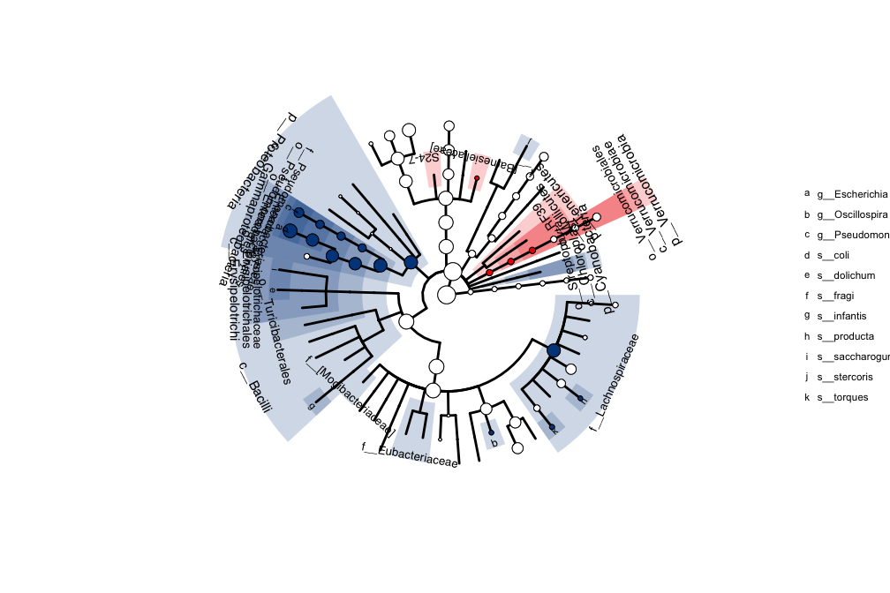
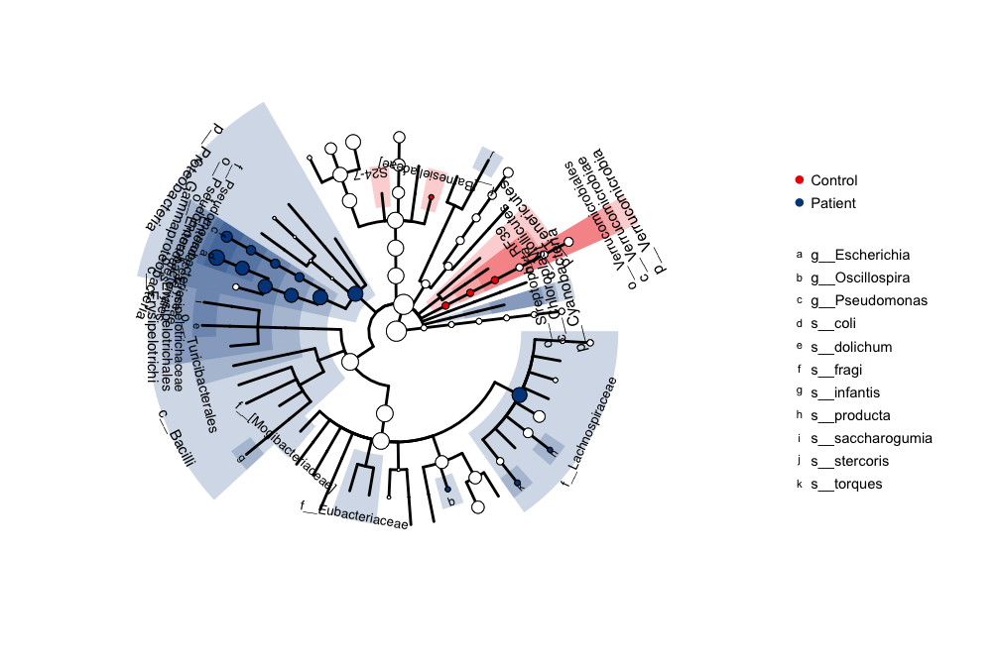

<!-- README.md is generated from README.Rmd. Please edit that file -->
phyloseqExtra
=============

PhyloseqExtra is a R package allows you to look at the phylogenic sequencing data in different phylogenic levels. As it iss named the core component of this package was built based on the [phyloseq](http://bioconductor.org/packages/release/bioc/html/phyloseq.html) package.

Install
-------

This package can be installed from github.

``` r
devtools::install_github("zhuchcn/phyloseqExtra")
```

Create a SummarizedPhyloseq object
----------------------------------

The SummarizedPhyloseq is a S4 class inherits from the phyloseq-class from the phyloseq package also contains 7 additional slots from species to kingdom to store the summarized abundance table.

``` r
library(phyloseq); library(phyloseqExtra)
data(fatigue)
spy = summarizeFromPhyloseq(fatigue)
spy
#> >>>>>>>>>>>>>>>> summarized phyloseq object <<<<<<<<<<<<<<<<
#> 
#> phyloseq-class experiment-level object
#> otu_table()   OTU Table:         [ 138 taxa and 87 samples ]
#> sample_data() Sample Data:       [ 87 samples by 22 sample variables ]
#> tax_table()   Taxonomy Table:    [ 138 taxa by 7 taxonomic ranks ]
#> 
#> phyloseq extra slots:
#> kingdom_table()   Kingdom Table: [ 2   taxa and 87 samples ]
#> phylum_table()    Phylum Table:  [ 9   taxa and 87 samples ]
#> class_table()     Class Table:   [ 16  taxa and 87 samples ]
#> order_table()     Order Table:   [ 19  taxa and 87 samples ]
#> family_table()    Family Table:  [ 30  taxa and 87 samples ]
#> genus_table()     Genus Table:   [ 40  taxa and 87 samples ]
#> species_table()   Species Table: [ 20  taxa and 87 samples ]
#> 
#> >>>>>>>>>>>>>>>> SummarizedPhyloseq-Class <<<<<<<<<<<<<<<<
```

Statistic analysis on all phylogenic levles
-------------------------------------------

We provides a encapsulated function to do statistic analysis using either DESeq2 or limma, and store the reults in a same structure as the SummarizedPhyloseq.

``` r
design = model.matrix(data = as(sample_data(fatigue), "data.frame"),
                      ~Subject + 1)
spys_de = spy_to_deseq2(spy, design, resultsName = "SubjectPatient")
spys_de
#> >>>>>>>>>>>>>>>>   SummarizedPhyloStats   <<<<<<<<<<<<<<<<<<<
#> 
#> kingdom_table()       [    2 taxa,   0 p<0.05,  0 padj<0.05 ]
#> phylum_table()        [    9 taxa,   4 p<0.05,  4 padj<0.05 ]
#> class_table()         [   16 taxa,   7 p<0.05,  6 padj<0.05 ]
#> order_table()         [   19 taxa,   9 p<0.05,  7 padj<0.05 ]
#> family_table()        [   30 taxa,  10 p<0.05,  8 padj<0.05 ]
#> genus_table()         [   40 taxa,   7 p<0.05,  3 padj<0.05 ]
#> species_table()       [   20 taxa,  10 p<0.05,  8 padj<0.05 ]
#> otu_table()           [  138 taxa,  37 p<0.05, NA padj<0.05 ]
```

Cladogram with microbiomeViz
----------------------------

Cladogram is a very useful visualization method for microbiome data with different phylogenic levels. Most current popular cladogram visualization tools are not able to use flexible statistic methods fo annotation. Here we provide a solution combining with the [microbiomeViz](https://github.com/lch14forever/microbiomeViz) package. Below is an example using the DESeq2 result to annotate the cladogram

``` r
library(ggplot2);library(microbiomeViz)
tr = parsePhyloseq(fatigue, node.size.scale = 1.25)
p = tree.backbone(tr, size=1)
anno.data = create_annodata(spys_de, coef = "padj", cutoff = 0.05)
p = clade.anno(p, anno.data)
p
```



The cladogram is a ggplot object, so it can take the theme function from ggplot for further formating.

``` r
p + geom_point(
    data=data.frame(x=1:2,  y=1:2, color=c("Control","Patient")),
    aes(x=x, y=y, color=color), size=0, stroke=0) +
    guides(
        color = guide_legend(
            override.aes = list(size=3, color= rev(c("#00468BFF", "#ED0000FF")))
        )) +
    theme(
    legend.text = element_text(size = 11),
    plot.margin = margin(l=0, r=160, t=0, b=0)
)
```


