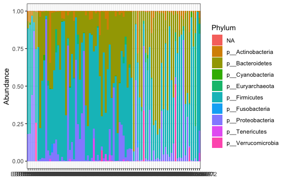
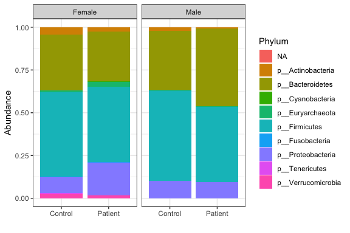
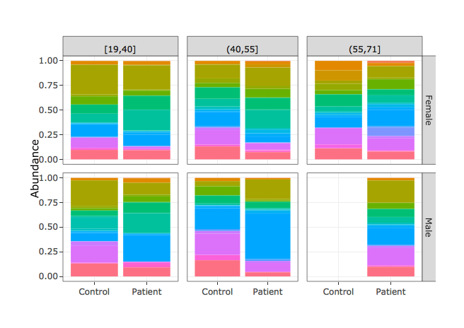
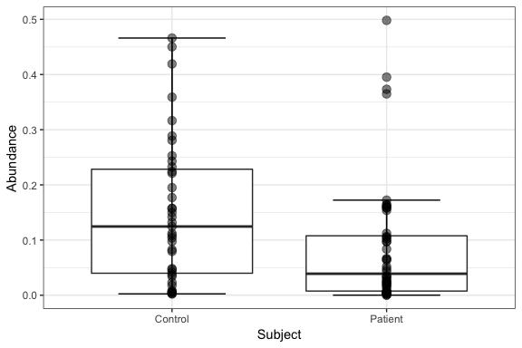
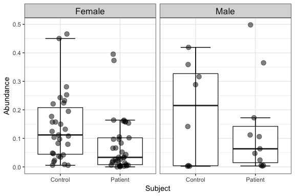
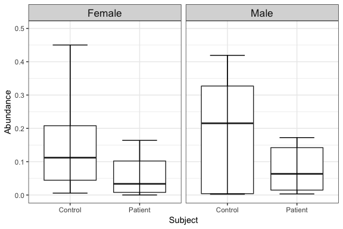
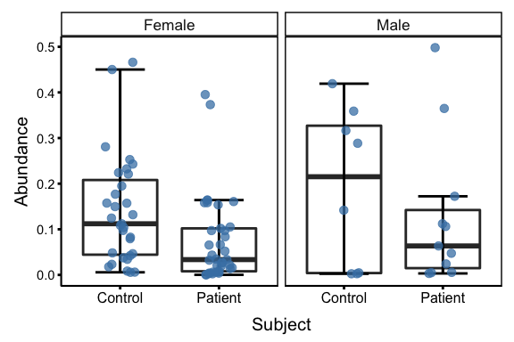
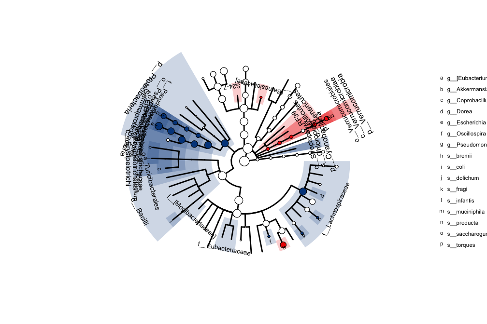
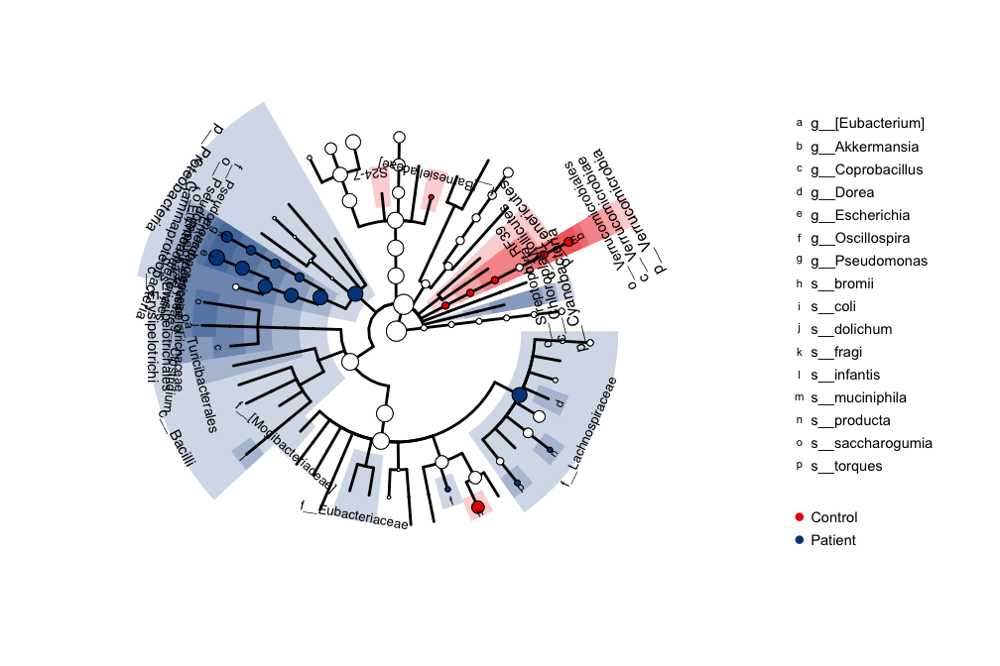

<!-- README.md is generated from README.Rmd. Please edit that file -->
phyloseqExtra
=============

Microbiome data generated by high through-put sequecing methods come with the phylogenic taxonomy informtation which is a hierachical. Researches often need to group OTUs/features base on their phylogenic information on different levels in order to find any potential point of interests. The phyloseqExtra is a R package allows user to look at the phylogenic sequencing data in different phylogenic levels. As it iss named the core component of this package was built based on the [phyloseq](http://bioconductor.org/packages/release/bioc/html/phyloseq.html) package. This tutorial shows a basic workflow of using this package to analyze microbiome data.

Install
-------

This package can be installed from github.

``` r
devtools::install_github("zhuchcn/phyloseqExtra")
```

Create a SummarizedPhyloseq object
----------------------------------

The workflow starts with the OTU/feature clustered OTU/feature table with taxonomy table to each OTU/feature. To generate the OTU/feature table, please refer to the [QIIME2](https://docs.qiime2.org/) or the [dada2](https://benjjneb.github.io/dada2/tutorial.html) tutorial. You need the three tables below in order to start.

-   OTU/feature table
-   Taxonomy table
-   Sample meta-data table

The 3 tables are first imported into a phyloseq object, followed by summarizing into a SummarizedPhyloseq object. The SummarizedPhyloseq is a S4 class inherits from the phyloseq-class from the phyloseq package, that contains 7 additional slots from species to kingdom to store the summarized abundance table.

``` r
library(phyloseq); library(phyloseqExtra)
data(fatigue)
fatigue = fix_duplicate_tax(fatigue)
spy = summarizeFromPhyloseq(fatigue)
spy
#> >>>>>>>>>>>>>>>> summarized phyloseq object <<<<<<<<<<<<<<<<
#> 
#> phyloseq-class experiment-level object
#> otu_table()   OTU Table:         [ 138 taxa and 87 samples ]
#> sample_data() Sample Data:       [ 87 samples by 23 sample variables ]
#> tax_table()   Taxonomy Table:    [ 138 taxa by 7 taxonomic ranks ]
#> 
#> phyloseq extra slots:
#> kingdom_table()   Kingdom Table: [   2 taxa and 87 samples ]
#> phylum_table()    Phylum Table:  [  10 taxa and 87 samples ]
#> class_table()     Class Table:   [  17 taxa and 87 samples ]
#> order_table()     Order Table:   [  20 taxa and 87 samples ]
#> family_table()    Family Table:  [  31 taxa and 87 samples ]
#> genus_table()     Genus Table:   [  41 taxa and 87 samples ]
#> species_table()   Species Table: [  21 taxa and 87 samples ]
#> 
#> >>>>>>>>>>>>>>>> SummarizedPhyloseq-Class <<<<<<<<<<<<<<<<
```

Statistic analysis on all phylogenic levles
-------------------------------------------

Researches often want to do hypothesis testing between different study group, population, or any other sample variable. We provide a encapsulated function to do statistic analysis on count data using the DESeq2 package, or relative abundant data using limma package, and then store the statistic results in a SummarizedPhyloStats object. These functions require the DESeq2 or limma packages pre-installed in your enviroment. These two packages can be installed from the bioconductor.

-   DESeq2

``` r
design = model.matrix(data = as(sample_data(fatigue), "data.frame"),
                      ~Subject + 1)
spys_de = spy_to_deseq2(spy, design, resultsName = "SubjectPatient")
spys_de
#> >>>>>>>>>>>>>>>>   SummarizedPhyloStats   <<<<<<<<<<<<<<<<<<<
#> 
#> kingdom_table()       [    2 taxa,   0 p<0.05,  0 padj<0.05 ]
#> phylum_table()        [   10 taxa,   4 p<0.05,  4 padj<0.05 ]
#> class_table()         [   17 taxa,   7 p<0.05,  6 padj<0.05 ]
#> order_table()         [   20 taxa,   9 p<0.05,  7 padj<0.05 ]
#> family_table()        [   31 taxa,  10 p<0.05,  8 padj<0.05 ]
#> genus_table()         [   41 taxa,  10 p<0.05,  8 padj<0.05 ]
#> species_table()       [   21 taxa,  10 p<0.05, NA padj<0.05 ]
#> otu_table()           [  138 taxa,  37 p<0.05, NA padj<0.05 ]
```

-   limma

``` r
spy_prop = summarizeFromPhyloseq(transform_sample_counts(fatigue, function(x) x/sum(x)))
spys_lm = spy_to_limma(spy_prop, design, p.value = 2, coef = 2)
spys_lm
#> >>>>>>>>>>>>>>>>   SummarizedPhyloStats   <<<<<<<<<<<<<<<<<<<
#> 
#> kingdom_table()       [    2 taxa,   0 p<0.05,  0 padj<0.05 ]
#> phylum_table()        [   10 taxa,   0 p<0.05,  0 padj<0.05 ]
#> class_table()         [   17 taxa,   0 p<0.05,  0 padj<0.05 ]
#> order_table()         [   20 taxa,   0 p<0.05,  0 padj<0.05 ]
#> family_table()        [   31 taxa,   2 p<0.05,  0 padj<0.05 ]
#> genus_table()         [   41 taxa,   5 p<0.05,  0 padj<0.05 ]
#> species_table()       [   21 taxa,   2 p<0.05,  1 padj<0.05 ]
#> otu_table()           [  138 taxa,  16 p<0.05,  0 padj<0.05 ]
```

Stacked Barplot
---------------

The plot\_bar() function can be used to quickly generate barplots. The function takes 5 arguments, a SummarizedPhyloseq object, a character variable *level* to specify the phylogenic level, a character variable *by* from the sample meta-data column names, a logical variable *show.legend*, and a logical variable *plotly*. The output is a ggplot object so you can add any ggplot function on it.

``` r
plot_bar(spy_prop)
```



The default value for level is *Phylum*. If the *by* argument is not specified, the sample id will be used and each sample will be an individual bar.

The *by* variable can take up to 3 elements.

``` r
plot_bar(spy_prop, level = "Phylum", by = c("Subject", "Sex"))
```



``` r
plot_bar(spy_prop, level = "Genus", by = c("Subject", "Sex", "age_range"), show.legend = F, plotly = T )
```



Boxplot function
----------------

The boxplot function takes more arguments. Please refer to the help document for the usage of each arguments.

-   Basic usage:

``` r
plot_box(spy_prop, level = "Genus", taxon = "g__Ruminococcus", by = "Subject")
```



-   the *jitter* argument will move the points around so they are less overlapping.

``` r
plot_box(spy_prop, level = "Genus", taxon = "g__Ruminococcus", by = c("Subject","Sex"), jitter = 0.15)
```



-   The points can be removed

``` r
plot_box(spy_prop, level = "Genus", taxon = "g__Ruminococcus", by = c("Subject", "Sex"), show.points = FALSE)
```



-   A pre-defined style *academic* can be called to generate a clean style for journal articles.

``` r
plot_box(spy_prop, level = "Genus", taxon = "g__Ruminococcus", by = c("Subject","Sex"), jitter = 0.15, box.size = 1, whisker.size = 1, point.alpha = 0.75, point.color = "steelblue", style = "academic")
```



The plot\_box function also can draw lines by specifying the *line* argument. This is particually usful for repearted measures.

Cladogram with microbiomeViz
----------------------------

Cladogram is a very useful visualization method for microbiome data with different phylogenic levels. Most current popular cladogram visualization tools are not able to use flexible statistic methods fo annotation. Here we provide a solution combining with the [microbiomeViz](https://github.com/lch14forever/microbiomeViz) package. Below is an example using the DESeq2 result to annotate the cladogram

``` r
library(ggplot2);library(microbiomeViz)
tr = parsePhyloseq(fatigue, node.size.scale = 1.25)
p = tree.backbone(tr, size=1)
anno.data = create_annodata(spys_de, coef = "padj", cutoff = 0.05)
p = clade.anno(p, anno.data)
p
```



The cladogram is a ggplot object, so it can take the theme function from ggplot for further formating.

``` r
p + geom_point(
    data=data.frame(x=1:2,  y=1:2, color=c("Control","Patient")),
    aes(x=x, y=y, color=color), size=0, stroke=0) +
    guides(
        color = guide_legend(
            override.aes = list(size=3, color= rev(c("#00468BFF", "#ED0000FF")))
        )) +
    theme(
    legend.text = element_text(size = 11),
    plot.margin = margin(l=0, r=160, t=0, b=0)
)
```


